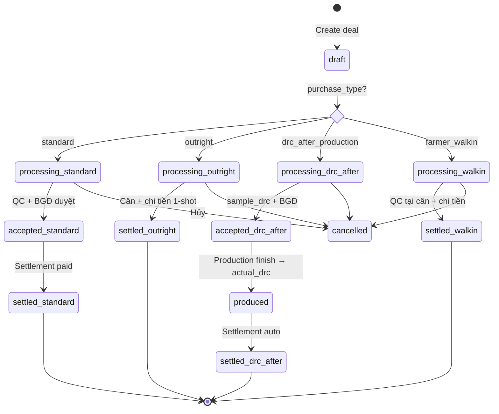

# 🌿 B2B Intake — Kế hoạch triển khai tổng hợp

**Ngày:** 2026-04-23
**Phiên bản:** 3.0 (consolidated — thay thế v1, v2)
**Scope:** 🎯 **CHỈ B2B** (không động Sales module)
**Sơ đồ tham chiếu:** [B2B_FLOWS_PRESENTATION.html](B2B_FLOWS_PRESENTATION.html) · [B2B_INTAKE_PROTOTYPE.html](B2B_INTAKE_PROTOTYPE.html)

---

## 0. Executive summary

### Hiện tại
- B2B chạy **1 flow duy nhất** (standard): chat/demand → deal processing → QC → BGĐ duyệt → nhập kho → tạm ứng → quyết toán → thanh toán
- Weighbridge cân 1 ticket = **1 deal** (không hỗ trợ xe nhiều lô)
- Không có flow cho hộ nông dân walk-in, không có flow mua đứt nhanh, không có flow "chạy đầu ra" rõ ràng cho đại lý

### Đề xuất v3
- ➕ **3 flow mới** song song standard: `outright` · `drc_after_production` · `farmer_walkin`
- ➕ **Multi-lot per ticket** (1 xe gom N hộ / N grade / N vườn)
- ➕ **Bảng giá ngày** + **household partner** + **tier-based advance**
- ➕ **Flow "chạy đầu ra" đại lý** có đặc thù riêng (pool/isolated, DRC variance, SLA, production cost)
- ➕ **Settlement tại cân** cho outright + walk-in (chi tiền ngay, không qua ERP)

### Effort
| Ước tính | Value |
|---|---|
| ERP (Sprint A-F) | **17-22 ngày** |
| Weighbridge app (song song) | **4 ngày** |
| Portal (badge purchase_type) | **0.5 ngày** |
| **Tổng** | **~4-5 tuần** |

### Rủi ro chính
1. Trigger Sprint J nới lỏng sai → cân lậu (mitigation: require `buyer_user_id`)
2. Flow đại lý DRC pool bất công → tranh chấp (mitigation: variance tolerance + dispute auto)
3. Schema migration point-of-no-return Sprint A (mitigation: rollback SQL sẵn + staging 48h)

---

## 1. Hiện trạng B2B — baseline

### 1.1 Schema hiện có (Sprint E-Q đã xong)

```
b2b.deals
├── id, deal_number, partner_id, deal_type, status
├── quantity_kg, expected_drc, actual_drc, final_value
├── product_type (mu_tap/mu_nuoc/mu_cao_su)
├── target_facility_id (commit ce6b30a — booking metadata kế thừa)
├── warehouse_id (demand-based)
└── Sprint J guards: weighbridge + stock-in + advance chỉ khi accepted

b2b_demands (public)
├── RLS: authenticated (Sprint L fix 403)
├── CHECK deadline ≥ published_at
└── Trigger sync_demand_filled

b2b.partner_ledger
├── Sprint N cumulative SUM running_balance
└── entry_type: advance_paid/settlement_receivable/payment_paid

b2b.partner_ratings
├── total_volume_kg
└── Trigger Sprint O: settled deal → auto tier upgrade
```

### 1.2 Luồng standard hiện tại (không thay đổi)

```
Portal/Chat    Kinh doanh        QC        BGĐ        Weighbridge    Kho        Kế toán
    │              │              │         │              │            │           │
    ├──booking────→│              │         │              │            │           │
    │              ├──create Deal │         │              │            │           │
    │              │  (processing)│         │              │            │           │
    │              │              ├──sample │              │            │           │
    │              │              │         ├──duyệt      │            │           │
    │              │              │         │ (accepted)   │            │           │
    │              │              │         │              ├──cân IN──→ │           │
    │              │              │         │              │            ├──stock_in │
    │              │              │         │              │            │           ├──advance
    │              │              │         │              │            │           ├──settlement
    │              │              │         │              │            │           └──paid (settled)
```

### 1.3 Gap với 3 flow mới

| # | Gap | Flow ảnh hưởng |
|---|---|---|
| G1 | `deal.purchase_type` chưa có | All 3 |
| G2 | Sprint J block cân khi deal chưa accepted | 🅰️ outright · 🅲 walk-in (bypass BGĐ) |
| G3 | `trg_deal_lock` block update `actual_drc` sau accepted | 🅱️ drc_after (cần update sau khi SX xong) |
| G4 | Ticket 1:1 với deal — không hỗ trợ N lô | All (S1-S4 scenarios) |
| G5 | Không có partner type='household' + CCCD | 🅲 walk-in |
| G6 | Không có daily price list | 🅲 walk-in |
| G7 | Không có tier-based advance max | All (đặc thù đại lý) |
| G8 | Không có pool/isolated production mode | 🅱️ đặc thù đại lý |
| G9 | Không có DRC variance tolerance + dispute auto | 🅱️ đặc thù đại lý |
| G10 | Không có settlement tại cân (chi tiền ngay) | 🅰️ + 🅲 |

---

## 2. 3 luồng mua mủ mới + standard (4 luồng tổng)

### 2.1 Bảng tóm tắt

| # | Flow | `purchase_type` | Đối tượng | Đặc thù | Thời gian từ cân → trả tiền |
|---|---|---|---|---|---|
| 📦 | **Standard** (giữ nguyên) | `standard` | Đại lý chat/demand | QC → BGĐ → SX/giao → QT | 7-30 ngày |
| 🅰️ | **Outright** (mua đứt) | `outright` | Đại lý VN · hộ Lào | Bypass QC/BGĐ · DRC cáp | **Ngay tại cân** |
| 🅱️ | **DRC-after-production** ⭐ | `drc_after_production` | Đại lý (tier ≥ silver) | QC mẫu → BGĐ → SX → DRC actual | 3-7 ngày (sau SX xong) |
| 🅲 | **Farmer walk-in** | `farmer_walkin` | Hộ nông dân VN | QC tại cân · giá ngày | **Ngay tại cân** |

### 2.2 State diagram 4 luồng



---

## 3. Flow 🅱️ "Chạy đầu ra" đại lý — deep dive

Đây là flow **phức tạp nhất** và là **rủi ro cao nhất** cho quan hệ với đại lý. Cần note kỹ 6 đặc thù.

### 3.1 Nghiệp vụ cơ bản

```
Đại lý giao mủ tạp ─→ Nhà máy cân + nhập kho
                             ↓
                     QC đo sample_drc (mẫu ~5kg)
                             ↓
                     BGĐ duyệt → deal.accepted
                             ↓
                     Ứng tạm tier-based (gold 70% × final_estimated)
                             ↓
                     Chạy sản xuất (3-7 ngày)
                             ↓
                     TP ra lò → finished_product_kg
                             ↓
                     actual_drc = finished_product_kg / nvl_kg × 100
                             ↓
                     Settlement: gross = nvl_kg × actual_drc/100 × price
                                 remaining = gross - advance
                             ↓
                     Thanh toán → deal.settled
```

### 3.2 6 đặc thù đại lý — CẦN IMPLEMENT

#### 🔸 Đặc thù 1: Pool vs Isolated production

**Vấn đề:** Đại lý A giao 10 tấn, nhà máy pool với 50 tấn của đại lý B,C → ra TP 18 tấn pooled → DRC thật của A bao nhiêu?

**Giải pháp:**
```sql
ALTER TABLE b2b.deals ADD COLUMN production_mode TEXT DEFAULT 'pooled'
  CHECK (production_mode IN ('pooled', 'isolated'));
ALTER TABLE b2b.deals ADD COLUMN production_pool_id UUID;  -- nhóm deal cùng pool
```

- **Pooled** (default): actual_drc = DRC trung bình weighted của toàn pool → đại lý chấp nhận rủi ro chung
- **Isolated** (premium, tier ≥ gold): chạy dây chuyền riêng, DRC chính xác 100% của lô đại lý → phí cao hơn 5-10%

**UI portal partner:** chọn khi gửi booking — checkbox "Yêu cầu chạy riêng (+5% phí)". Default pooled.

#### 🔸 Đặc thù 2: DRC variance tolerance

**Vấn đề:** Đại lý đưa sample QC 35%, actual pool ra 30% → mất 14% tiền so với dự kiến. Có tranh chấp?

**Giải pháp:**
```sql
-- Constant trong app
const MAX_DRC_VARIANCE_PCT = 3;  -- 3% tolerance

-- Trigger auto-dispute khi actual_drc được set
IF ABS(NEW.actual_drc - NEW.sample_drc) > 3 THEN
  INSERT INTO b2b.drc_disputes (
    deal_id, partner_id, expected_drc, actual_drc, reason, status
  ) VALUES (
    NEW.id, NEW.partner_id, NEW.sample_drc, NEW.actual_drc,
    'Auto-raised: variance > 3%', 'open'
  );
  -- Hold settlement cho đến khi dispute resolved
END IF;
```

**Partner portal notification:** "Deal DL-xxx có chênh lệch DRC 5% — đã tự raise khiếu nại, BGĐ sẽ review trong 24h"

#### 🔸 Đặc thù 3: Production progress visibility

**Vấn đề:** Đại lý không biết lô mình đang ở stage nào → lo lắng, gọi hỏi nhiều.

**Giải pháp:** Portal partner trang mới `/portal/deals/:id/production`:

```
┌─────────────────────────────────────────────────┐
│  Deal DL2604-AGX · 10 tấn mủ tạp · 25/04/2026    │
├─────────────────────────────────────────────────┤
│  ✅ Đã cân xong          25/04 08:30            │
│  ✅ Đã nhập kho          25/04 09:15            │
│  ✅ QC sample DRC=35%    25/04 10:00            │
│  ✅ BGĐ duyệt           25/04 14:00            │
│  ✅ Tạm ứng 50M          25/04 16:00            │
│  🔄 Đang sản xuất        Est. 28/04 (2 ngày)    │
│  ⏳ Chờ ra TP                                   │
│  ⏳ Quyết toán                                  │
│  ⏳ Thanh toán                                  │
└─────────────────────────────────────────────────┘
```

Realtime update khi `production_orders.status` thay đổi.

#### 🔸 Đặc thù 4: SLA sản xuất (deadline trả tiền)

**Vấn đề:** Đại lý không biết bao giờ được thanh toán → trôi vốn, giảm lòng tin.

**Giải pháp:**
```sql
ALTER TABLE b2b.deals ADD COLUMN production_sla_days INT DEFAULT 7;
ALTER TABLE b2b.deals ADD COLUMN production_started_at TIMESTAMPTZ;
ALTER TABLE b2b.deals ADD COLUMN production_sla_deadline TIMESTAMPTZ
  GENERATED ALWAYS AS (production_started_at + (production_sla_days || ' days')::interval) STORED;
```

Cron daily: nếu `NOW() > production_sla_deadline AND actual_drc IS NULL`:
- Notification BGĐ + partner: "Deal DL-xxx quá SLA, chưa có DRC actual"
- Auto-trigger advance bổ sung 10% (nếu đại lý tier ≥ gold)

#### 🔸 Đặc thù 5: Settlement preview

**Vấn đề:** Đại lý chỉ thấy số tiền cuối khi settlement đã confirmed → không có cơ hội đàm phán.

**Giải pháp:** Compute realtime dựa trên `sample_drc`, hiển thị với disclaimer:

```typescript
// src/services/b2b/dealService.ts
function previewSettlement(deal: Deal): Preview {
  const preview_gross = deal.quantity_kg * deal.sample_drc / 100 * deal.price_per_kg;
  const preview_remaining = preview_gross - deal.advance_paid;
  return {
    estimated_gross: preview_gross,
    estimated_remaining: preview_remaining,
    range: {
      low: preview_remaining * 0.95,   // DRC xuống 3%
      high: preview_remaining * 1.05,  // DRC lên 3%
    },
    disclaimer: 'Ước tính dựa trên DRC mẫu. Actual có thể ±5% tùy kết quả sản xuất.',
  };
}
```

UI hiển thị ngay sau khi cân xong + BGĐ duyệt.

#### 🔸 Đặc thù 6: Reject production output (TP không đạt chuẩn)

**Vấn đề:** TP ra màu xấu, nhiễm bẩn → ai chịu phí? Đại lý (mủ nguyên liệu kém) hay nhà máy (SX lỗi)?

**Giải pháp:**
```sql
ALTER TABLE b2b.deals ADD COLUMN production_reject_reason TEXT
  CHECK (production_reject_reason IN (
    'raw_material_quality',      -- mủ đại lý xấu → đại lý chịu 100%
    'production_error',           -- nhà máy SX lỗi → nhà máy chịu 100%
    'force_majeure',              -- thiên tai, điện cắt → 50/50
    NULL
  ));
ALTER TABLE b2b.deals ADD COLUMN reject_loss_amount NUMERIC(14,2);
```

Workflow:
1. QC TP final → nếu không đạt, BGĐ chọn reason
2. Auto-compute loss (`expected_gross - actual_gross`)
3. Phân bổ theo rule:
   - `raw_material_quality`: trừ loss từ settlement đại lý
   - `production_error`: nhà máy chịu, settlement đại lý full
   - `force_majeure`: 50/50
4. Có dispute flow nếu đại lý không đồng ý

### 3.3 Edge cases Flow 🅱️ khác

| # | Case | Xử lý |
|---|---|---|
| E1 | Đại lý gộp 2 lô khác sample_drc | Multi-lot: mỗi lô 1 item, actual_drc tính riêng |
| E2 | Đại lý rút mủ giữa chừng (nhà máy chưa SX) | Cancel deal → hoàn stock-in → refund advance (via ledger reverse entry) |
| E3 | Production yield < 80% expected | Auto-pause settlement, trigger review BGĐ |
| E4 | Nhiều deal cùng đại lý ghép 1 lô SX | `production_pool_id` share, allocate TP theo tỷ lệ `nvl_kg` |
| E5 | Tỷ giá thay đổi giữa advance và settlement | Lưu `advance_exchange_rate` + `settlement_exchange_rate` riêng |
| E6 | Partner tier downgrade giữa chừng | Lock advance max theo tier **tại thời điểm cân** (không apply tier mới) |

---

## 4. Multi-lot architecture (CORE — Sprint A)

### 4.1 Vì sao là CORE (không phải add-on)

4 scenarios thực tế **không thể tránh**:
- **S1:** Tài xế gom 3 hộ nông dân 3 xã khác nhau → 1 xe
- **S2:** 1 xe chở 2 loại mủ (nước + tạp) — giá khác nhau
- **S3:** Đại lý có 2 vườn DRC khác nhau → 1 chuyến
- **S4:** Demand multi-lot accept → nhiều deal cùng 1 ticket

Nếu không có multi-lot ở Sprint A → phải rework toàn bộ Sprint D UI khi gặp case đầu tiên.

### 4.2 Schema `weighbridge_ticket_items`

```sql
CREATE TABLE weighbridge_ticket_items (
  id UUID PRIMARY KEY DEFAULT gen_random_uuid(),
  ticket_id UUID NOT NULL REFERENCES weighbridge_tickets(id) ON DELETE CASCADE,
  line_no INT NOT NULL,

  -- EXACTLY 1 of 3 source (CHECK)
  deal_id      UUID REFERENCES b2b_deals(id),
  partner_id   UUID REFERENCES b2b_partners(id),
  supplier_id  UUID REFERENCES rubber_suppliers(id),

  rubber_type TEXT NOT NULL,
  lot_code TEXT,
  declared_qty_kg NUMERIC(12,2) NOT NULL CHECK (declared_qty_kg > 0),
  actual_qty_kg NUMERIC(12,2),      -- auto-compute by trigger
  drc_percent NUMERIC(5,2),
  unit_price NUMERIC(12,2),
  line_amount_vnd NUMERIC(14,2),    -- auto-compute
  notes TEXT,
  created_at TIMESTAMPTZ DEFAULT NOW(),

  UNIQUE (ticket_id, line_no),
  CONSTRAINT chk_exactly_one_source CHECK (
    (deal_id IS NOT NULL)::INT +
    (partner_id IS NOT NULL)::INT +
    (supplier_id IS NOT NULL)::INT = 1
  )
);

ALTER TABLE weighbridge_tickets
  ADD COLUMN has_items BOOLEAN NOT NULL DEFAULT FALSE,
  ADD COLUMN allocation_mode TEXT NOT NULL DEFAULT 'by_share'
    CHECK (allocation_mode IN ('by_share', 'direct'));
-- by_share: actual = net × (declared / sum(declared))
-- direct: actual = declared, sum phải = net (enforce trigger)

ALTER TABLE stock_in_details
  ADD COLUMN ticket_item_id UUID REFERENCES weighbridge_ticket_items(id),
  ADD COLUMN deal_id UUID REFERENCES b2b_deals(id),
  ADD COLUMN lot_code TEXT;
```

### 4.3 Trigger allocate

```sql
CREATE OR REPLACE FUNCTION allocate_ticket_item_weights()
RETURNS TRIGGER LANGUAGE plpgsql AS $$
DECLARE
  t weighbridge_tickets%ROWTYPE;
  total_declared NUMERIC;
BEGIN
  SELECT * INTO t FROM weighbridge_tickets WHERE id = NEW.ticket_id;
  IF t.net_weight IS NULL OR NOT t.has_items THEN RETURN NEW; END IF;

  SELECT SUM(declared_qty_kg) INTO total_declared
  FROM weighbridge_ticket_items WHERE ticket_id = t.id;

  IF t.allocation_mode = 'by_share' AND total_declared > 0 THEN
    UPDATE weighbridge_ticket_items
    SET actual_qty_kg = ROUND(t.net_weight * declared_qty_kg / total_declared, 2),
        line_amount_vnd = ROUND(
          t.net_weight * declared_qty_kg / total_declared
          * COALESCE(drc_percent, 100) / 100
          * COALESCE(unit_price, 0), 0)
    WHERE ticket_id = t.id;
  ELSIF t.allocation_mode = 'direct' THEN
    IF ABS(COALESCE(total_declared, 0) - t.net_weight) > 1 THEN
      RAISE EXCEPTION 'Mode direct: tổng declared (%) phải = NET (%)',
        total_declared, t.net_weight;
    END IF;
    UPDATE weighbridge_ticket_items
    SET actual_qty_kg = declared_qty_kg,
        line_amount_vnd = ROUND(declared_qty_kg * COALESCE(drc_percent,100)/100
                                * COALESCE(unit_price,0), 0)
    WHERE ticket_id = t.id;
  END IF;
  RETURN NEW;
END $$;
```

### 4.4 Helper `getTicketLines()` unify API

```typescript
// src/services/weighbridge/ticketLinesService.ts
export async function getTicketLines(ticketId: string): Promise<TicketLine[]> {
  const ticket = await weighbridgeService.getById(ticketId);
  if (ticket.has_items) {
    const { data } = await supabase
      .from('weighbridge_ticket_items')
      .select('*').eq('ticket_id', ticketId).order('line_no');
    return (data || []).map(i => ({ ...i, _source: 'item' }));
  }
  // Synthesize 1 line từ scalar (backward-compat)
  return [{
    line_no: 1,
    deal_id: ticket.deal_id,
    partner_id: ticket.partner_id,
    supplier_id: ticket.supplier_id,
    rubber_type: ticket.rubber_type,
    lot_code: ticket.lot_code,
    actual_qty_kg: ticket.net_weight,
    drc_percent: ticket.expected_drc,
    unit_price: ticket.unit_price,
    line_amount_vnd: ticket.net_weight * (ticket.expected_drc || 100) / 100 * (ticket.unit_price || 0),
    _source: 'scalar',
  }];
}
```

**Mọi downstream code chỉ gọi `getTicketLines()`** — không branch `if has_items else`.

### 4.5 UI `<MultiLotEditor/>`

```
┌──────────────────────────────────────────────────────────┐
│ Nguồn hàng trên xe                          [+ Thêm lô]   │
├────┬──────────────┬──────────┬──────┬──────┬──────┬─────┤
│ #1 │ ĐL ABC       │ Mủ nước  │ 600  │ 35%  │ 13k  │ [x] │
│ #2 │ Hộ Nguyễn V. │ Mủ tạp   │ 400  │ 28%  │  8k  │ [x] │
├────┴──────────────┴──────────┴──────┴──────┴──────┴─────┤
│ Tổng declared: 1.000 kg  │  NET cân: 985 kg               │
│ Allocation: by_share (phân bổ theo tỷ lệ)                  │
└──────────────────────────────────────────────────────────┘
```

- Mặc định 1 dòng (UX giống cũ)
- Click **+ Thêm lô** → thêm dòng
- Mỗi dòng: chọn deal có sẵn / partner quick-create / supplier
- Save: nếu 1 dòng → ticket `has_items=false` scalar; nếu N dòng → `has_items=true` items

---

## 5. Schema changes — consolidated

### 5.1 Tổng hợp 5 migration

```sql
-- ═══ MIGRATION 1: b2b.deals — 5 cột mới ═══
ALTER TABLE b2b.deals
  ADD COLUMN purchase_type TEXT NOT NULL DEFAULT 'standard'
    CHECK (purchase_type IN ('standard','outright','drc_after_production','farmer_walkin')),
  ADD COLUMN buyer_user_id UUID,
  ADD COLUMN qc_user_id UUID,
  ADD COLUMN sample_drc NUMERIC(5,2),
  ADD COLUMN finished_product_kg NUMERIC(12,2),
  ADD COLUMN production_mode TEXT DEFAULT 'pooled'
    CHECK (production_mode IN ('pooled', 'isolated')),
  ADD COLUMN production_pool_id UUID,
  ADD COLUMN production_sla_days INT DEFAULT 7,
  ADD COLUMN production_started_at TIMESTAMPTZ,
  ADD COLUMN production_reject_reason TEXT
    CHECK (production_reject_reason IN ('raw_material_quality','production_error','force_majeure')),
  ADD COLUMN reject_loss_amount NUMERIC(14,2);

-- Backfill (trước khi NOT NULL)
UPDATE b2b.deals SET purchase_type = 'standard' WHERE purchase_type IS NULL;

-- ═══ MIGRATION 2: b2b.partners — household + CCCD ═══
ALTER TABLE b2b.partners
  ADD COLUMN national_id TEXT,
  ADD COLUMN nationality TEXT DEFAULT 'VN' CHECK (nationality IN ('VN','LAO'));
CREATE UNIQUE INDEX IF NOT EXISTS ux_partners_national_id
  ON b2b.partners(national_id) WHERE national_id IS NOT NULL;
-- partner_type thêm 'household' vào CHECK hiện tại

-- ═══ MIGRATION 3: b2b.daily_price_list (MỚI) ═══
CREATE TABLE b2b.daily_price_list (
  id UUID PRIMARY KEY DEFAULT gen_random_uuid(),
  effective_from TIMESTAMPTZ NOT NULL DEFAULT NOW(),
  effective_to TIMESTAMPTZ,
  product_code TEXT NOT NULL,
  base_price_per_kg NUMERIC(12,2) NOT NULL,
  notes TEXT,
  created_by UUID,
  EXCLUDE USING gist (
    product_code WITH =,
    tstzrange(effective_from, effective_to) WITH &&
  )
);
CREATE INDEX idx_daily_price_product_time ON b2b.daily_price_list(product_code, effective_from DESC);

-- ═══ MIGRATION 4: weighbridge multi-lot ═══
CREATE TABLE weighbridge_ticket_items ( ... -- xem §4.2 );
ALTER TABLE weighbridge_tickets
  ADD COLUMN has_items BOOLEAN NOT NULL DEFAULT FALSE,
  ADD COLUMN allocation_mode TEXT NOT NULL DEFAULT 'by_share'
    CHECK (allocation_mode IN ('by_share', 'direct'));
ALTER TABLE stock_in_details
  ADD COLUMN ticket_item_id UUID REFERENCES weighbridge_ticket_items(id),
  ADD COLUMN deal_id UUID REFERENCES b2b_deals(id),
  ADD COLUMN lot_code TEXT;
CREATE TRIGGER trg_items_allocate_on_insert ...  -- xem §4.3

-- ═══ MIGRATION 5: Triggers bypass Sprint J cho outright + walk-in ═══
-- Rewrite trg_enforce_weighbridge_accepted + trg_enforce_b2b_stock_in_accepted
-- + trg_deal_lock (exception actual_drc cho drc_after)
-- Chi tiết ở Sprint B

-- ═══ MIGRATION 6: Trigger auto-dispute DRC variance (Flow 🅱️) ═══
CREATE OR REPLACE FUNCTION auto_raise_drc_dispute()
RETURNS TRIGGER LANGUAGE plpgsql AS $$
DECLARE variance_pct NUMERIC;
BEGIN
  IF NEW.actual_drc IS NOT NULL AND OLD.actual_drc IS NULL
     AND NEW.sample_drc IS NOT NULL
     AND NEW.purchase_type = 'drc_after_production' THEN
    variance_pct := ABS(NEW.actual_drc - NEW.sample_drc);
    IF variance_pct > 3 THEN
      INSERT INTO b2b.drc_disputes (
        deal_id, partner_id, expected_drc, actual_drc, reason, status
      ) VALUES (
        NEW.id, NEW.partner_id, NEW.sample_drc, NEW.actual_drc,
        format('Auto-raised: variance %.2f%% > 3%%', variance_pct), 'open'
      );
    END IF;
  END IF;
  RETURN NEW;
END $$;
CREATE TRIGGER trg_drc_variance_dispute
  AFTER UPDATE OF actual_drc ON b2b.deals
  FOR EACH ROW WHEN (NEW.purchase_type = 'drc_after_production')
  EXECUTE FUNCTION auto_raise_drc_dispute();
```

### 5.2 Summary table

| Object | Type | Purpose |
|---|---|---|
| `b2b.deals.purchase_type` + 10 cột | ALTER | Phân luồng 3 flow + đặc thù đại lý |
| `b2b.partners.national_id` + nationality | ALTER | Household VN/LAO |
| `b2b.daily_price_list` | CREATE TABLE | Giá ngày cho walk-in |
| `weighbridge_ticket_items` | CREATE TABLE | Multi-lot core |
| `weighbridge_tickets.has_items` | ALTER | Flag multi-lot |
| `stock_in_details.ticket_item_id` | ALTER | Link N batches về N items |
| `trg_enforce_weighbridge_accepted` | REPLACE | Bypass outright/walk-in + support multi-lot |
| `trg_deal_lock` | REPLACE | Exception drc_after update actual_drc |
| `trg_drc_variance_dispute` | CREATE | Auto-raise dispute (Flow 🅱️) |
| `allocate_ticket_item_weights` | CREATE | Multi-lot weight distribution |

---

## 6. 9 default BGĐ approve (lặp từ v2)

| # | Câu hỏi | Default approve-ready | Nếu BGĐ muốn khác |
|---|---|---|---|
| 1 | Range DRC cáp? | **25-70%**, warning nếu lệch ±10% trung bình 30 ngày | Hardcode từng grade |
| 2 | Công thức flow 🅰️? | **qty × price** (DRC bake vào price) | qty × drc × price_base |
| 3 | Chụp ảnh xe/mủ? | **Bắt buộc 2 ảnh** (xe + mẫu mủ) | Optional |
| 4 | Bảng giá từ đâu? | **Table `daily_price_list`**, admin nhập 7h sáng | API giá quốc tế |
| 5 | Tier advance max %? | **diamond 85 · gold 70 · silver 55 · bronze 40 · new 25** | Negotiate per deal |
| 6 | Trừ phí SX vào settlement? | **KHÔNG** (ghi riêng `production_cost`) | Trừ 3-5% cháy đầu ra |
| 7 | CMND flow 🅲? | **Bắt buộc** (GTGT + audit) | Optional nếu &lt; 500kg |
| 8 | Farmer table? | **Mở rộng `b2b.partners` + `type='household'`** | Tách table riêng |
| 9 | Hộ LAO đi flow 🅲? | **KHÔNG** — hộ LAO đi flow 🅰️ qua đại lý | Cho phép nếu có hộ chiếu |

**Default 10 bổ sung cho Flow 🅱️ đại lý:**
- **Production mode default:** `pooled` (isolated chỉ cho tier gold+ với phí +5-10%)
- **DRC variance threshold:** `3%` (auto dispute nếu vượt)
- **Production SLA:** `7 ngày` (nếu vượt → advance bổ sung tier gold+)
- **Production reject split:** `raw_quality → đại lý 100%` · `production_error → nhà máy 100%` · `force_majeure → 50/50`

---

## 7. Sprint plan — 7 sprints

| Sprint | Effort | Deliverable |
|---|---|---|
| 🅰️ **A** Foundation | 4 ngày | Schema 5 migration + multi-lot + Deal TS interface |
| 🅱️ **B** Triggers exception | 1.5 ngày | Sprint J bypass + deal_lock exception |
| 🅲 **B1** Flow 🅱️ đại lý hardening | 2 ngày | Pool/isolated + variance dispute + SLA + reject |
| 🅳 **C** Service layer | 3 ngày | Household + daily price + 3 orchestrator |
| 🅴 **D** UI 3 flow + MultiLotEditor | 4 ngày | 3 wizard + settings page |
| 🅵 **E** Tier advance + polish | 1.5 ngày | 5 tier × 5% max + UI preview |
| 🅶 **F** QA + deploy 3 wave | 2 ngày | Test plan + production deploy |
| **Tổng** | **18 ngày** | ~3.5 tuần (ERP only) |
| Weighbridge song song | +4 ngày | Settlement modal + QC input + multi-lot |
| **Grand total** | **~4-5 tuần** | Calendar time |

### Sprint A — Foundation (4 ngày) | CRITICAL

**Gate out:** build xanh, migration rollback SQL sẵn, test schema verify PASS.

| Task | Effort |
|---|---|
| A.1 Migration 1 (b2b.deals +10 cột) | 0.5 |
| A.2 Migration 2 (b2b.partners household) | 0.3 |
| A.3 Migration 3 (daily_price_list tstzrange) | 0.4 |
| A.4 Migration 4 (weighbridge multi-lot) + trigger allocate | 1 |
| A.5 Backfill deals.purchase_type='standard' | 0.2 |
| A.6 Regenerate Supabase types + update Deal TS interface | 0.5 |
| A.7 Helper `getTicketLines()` + unit test | 0.5 |
| A.8 Rollback SQL sẵn sàng + run rollback test trên staging | 0.3 |
| A.9 Final build + tsc + regression test standard flow | 0.3 |

### Sprint B — Triggers exception (1.5 ngày) | HIGH

| Task | Effort |
|---|---|
| B.1 Rewrite `trg_enforce_weighbridge_accepted` — bypass `outright`/`walk-in` + support `has_items` | 0.5 |
| B.2 Rewrite `trg_enforce_b2b_stock_in_accepted` — tương tự | 0.3 |
| B.3 Exception `trg_deal_lock` — flow 🅱️ actual_drc NULL→value (1 lần) | 0.3 |
| B.4 5 test cases (3 flow happy + 2 regression standard) | 0.4 |

### Sprint B1 — Flow 🅱️ đại lý hardening (2 ngày) | HIGH

**Đặc biệt:** sprint này **mới so với v1/v2** — cover 6 đặc thù đại lý.

| Task | Effort |
|---|---|
| B1.1 Migration columns production_mode / pool_id / sla_days / reject_reason | 0.3 |
| B1.2 Trigger `auto_raise_drc_dispute` (variance > 3%) | 0.3 |
| B1.3 Cron daily SLA check + notification | 0.4 |
| B1.4 Service `previewSettlement(deal)` với range low/high | 0.3 |
| B1.5 Service `productionProgressService` — timeline stages cho portal | 0.4 |
| B1.6 Reject logic (3 reason × 3 loss split) + dispute cascade | 0.3 |

### Sprint C — Service layer (3 ngày) | HIGH

| Task | Effort |
|---|---|
| C.1 `partnerService.quickCreateHousehold()` + CCCD validate | 0.5 |
| C.2 `dailyPriceListService` — CRUD + `getCurrent(product, at=NOW)` | 0.5 |
| C.3 `intakeOutrightService.execute()` — 1-transaction RPC orchestrator | 0.5 |
| C.4 `intakeWalkinService.execute()` — dùng daily price | 0.5 |
| C.5 `intakeProductionService` + hook `productionOutputHookService.onFinish()` | 0.5 |
| C.6 `batchService.generateBatchCode(purchase_type, nationality)` — LAO-/PCB-/FW- | 0.2 |
| C.7 `autoSettlementService.createFromTicket()` multi-lot fan-out | 0.3 |

### Sprint D — UI 3 flow + MultiLotEditor (4 ngày) | HIGH

| Task | Effort |
|---|---|
| D.1 Component `<MultiLotEditor/>` — default 1 dòng | 1 |
| D.2 Page `/b2b/intake/outright` (4-step wizard) | 0.7 |
| D.3 Page `/b2b/intake/production` (8-step wizard) + Production Progress component | 1 |
| D.4 Page `/b2b/intake/walkin` (4-step) + CCCD input + camera upload | 0.7 |
| D.5 Page `/b2b/settings/daily-prices` (admin nhập giá) | 0.3 |
| D.6 Portal partner trang `/deals/:id/production` (timeline visibility) | 0.3 |

### Sprint E — Tier advance + polish (1.5 ngày) | MED

| Task | Effort |
|---|---|
| E.1 Constants `ADVANCE_MAX_PERCENT_BY_TIER` | 0.2 |
| E.2 Guard `advanceService.createAdvance` — reject nếu vượt tier max | 0.3 |
| E.3 UI form advance: input max warning + preview | 0.3 |
| E.4 Settlement preview UI trên detail page (low/high range) | 0.4 |
| E.5 Polish: loading, error toast, mobile responsive | 0.3 |

### Sprint F — QA + deploy (2 ngày) | HIGH

| Task | Effort |
|---|---|
| F.1 Test plan 4 flow × (happy + 3 edge case) + 8 multi-lot (ML-1..ML-8) + 6 đặc thù đại lý (E1-E6) | 0.6 |
| F.2 E2E SQL `.tmp/e2e_b2b_intake.py` + manual UI smoke test | 0.5 |
| F.3 Deploy wave 1: SQL Sprint A (nullable, backward-compat) | 0.2 |
| F.4 Deploy wave 2: SQL Sprint B + B1 + FE Sprint C service | 0.3 |
| F.5 Deploy wave 3: FE Sprint D UI 3 flow + portal partner | 0.3 |
| F.6 Monitor 48h: error rate, ticket mismatch, DRC dispute rate | 0.1 |

---

## 8. Risk matrix + rollback per sprint

### 8.1 Risk matrix

| Rủi ro | Mức | Mitigation |
|---|---|---|
| Trigger Sprint J nới lỏng sai → cân lậu | 🔴 HIGH | Exception chỉ kích hoạt khi `purchase_type IN (outright, walk-in)` VÀ `buyer_user_id IS NOT NULL` (có người chịu trách nhiệm) |
| Flow 🅱️ actual_drc bypass lock → tranh chấp | 🔴 HIGH | Exception chỉ cho update 1 lần NULL→value. Sau đó LOCK. DB trigger enforce. |
| Multi-lot allocate lệch > 1kg | 🟠 MED | Mode `direct`: RAISE EXCEPTION. Mode `by_share`: precision NUMERIC(12,2) |
| DRC variance auto-dispute spam | 🟠 MED | Threshold 3% có thể điều chỉnh per partner tier. Cron daily deduplicate. |
| Pool production DRC không fair | 🔴 HIGH | Hiển thị pool members public. Weighted average theo nvl_kg. Isolated mode cho đại lý tier gold+ muốn tránh. |
| Daily price race 23:59/00:01 | 🟠 MED | tstzrange + EXCLUDE gist → không overlap không gap |
| CCCD duplicate giữa hộ và đại lý | 🟡 LOW | UNIQUE INDEX `b2b.partners.national_id` |
| Backfill purchase_type='standard' miss | 🔴 HIGH | Verify `COUNT(*) FILTER (WHERE NULL) = 0` trước khi SET NOT NULL |
| Portal badge purchase_type sai | 🟡 LOW | Portal chỉ read — deploy wave cuối |
| App cân v1 không hiểu `has_items=true` | 🟠 MED | Sprint A deploy trước, app cân deploy wave 2 sau khi có helper |
| Production SLA quá ngắn 7 ngày | 🟠 MED | Configurable per partner tier (diamond 5d / gold 7d / silver 10d) |
| Reject reason đại lý không chấp nhận | 🔴 HIGH | Reuse dispute flow hiện có. BGĐ resolve với adjustment_amount. |

### 8.2 Rollback per sprint

| Fail at | Rollback | Data impact |
|---|---|---|
| Sprint F post-deploy | Revert FE → user quay về standard flow | Ticket mới `purchase_type` orphan → cron auto-fix |
| Sprint E advance guard | Revert constants → advance không giới hạn | Không mất data |
| Sprint D UI | Revert FE → UI không hiện 3 flow | DB đã có schema, không break |
| Sprint C service | Revert service → API cũ | Trigger mới chạy OK standard flow |
| Sprint B1 đại lý | Revert 4 trigger B1 → không auto-dispute | Flow 🅱️ degraded nhưng không crash |
| Sprint B trigger | `DROP TRIGGER ... CREATE old` | Flow 🅰️🅲 block, standard OK |
| Sprint A schema | **KHÔNG rollback** (point of no return) | Nullable columns backward-compat |

**Key rule:** Sprint A = **point of no return**. Pre-deploy phải có staging 48h + regression test full.

---

## 9. Weighbridge app coordination

`can.huyanhrubber.vn` (deploy riêng `apps/weighbridge/`) share DB Supabase. Sprint A migration phải compat.

### 9.1 Gap app cân

| # | Gap | Sprint fix |
|---|---|---|
| W1 | `weighbridge_tickets.source_type` chưa có | Sprint A |
| W2 | Không UI quick-create household | Sprint D reuse |
| W3 | Không settlement modal tại cân (flow 🅰️🅲) | Sprint D add |
| W4 | Không QC DRC input tại cân (flow 🅲) | Sprint D add |
| W5 | Không daily price lookup | Sprint C reuse |
| W6 | HomePage filter deal `status` cứng | Sprint D update |
| W7 | Trigger block cân khi chưa accepted | Sprint B bypass |
| W8 | Seed `weighbridge_scales` | Sprint A data seed |

### 9.2 App cân effort (+4 ngày song song)

| Sprint | Task | Effort |
|---|---|---|
| W-A | Schema share + seed scales | 0.5 |
| W-D1 | Outright flow UI + settlement modal | 1.5 |
| W-D2 | Farmer walk-in UI + CCCD + daily price + QC input | 1.5 |
| W-D3 | DRC-after reuse existing flow (chỉ filter include `drc_after_production`) | 0.5 |

### 9.3 Deploy 3 wave

| Wave | Target | Content |
|---|---|---|
| 1 | ERP + weighbridge + portal | SQL Sprint A nullable (backward-compat) |
| 2 | ERP + weighbridge | SQL Sprint B + B1 + FE Sprint C service |
| 3 | ERP + weighbridge + portal | FE Sprint D UI + portal badge |

**Sau 48h monitor wave 3:** SQL Sprint A2 SET NOT NULL + cleanup.

---

## 10. Permission & role (B2B only — không Sales)

### 10.1 Roles cần

- **Admin BGĐ** — full quyền, duyệt deal, resolve dispute
- **Kinh doanh (sale)** — tạo deal standard, chốt offer
- **QC** — đo sample_drc + actual_drc
- **Kế toán** — advance + settlement + payment
- **Weighbridge operator (scale_operator)** — cân, KHÔNG sửa deal
- **NEW: Intake operator** — quick-create household + chi tiền cash flow 🅰️🅲

### 10.2 RLS mới cần

```sql
-- Household partner — không có user account, chỉ admin/kế toán thấy
CREATE POLICY b2b_partners_household_read ON b2b.partners
  FOR SELECT TO authenticated USING (
    partner_type != 'household' OR auth.uid() IN (
      SELECT user_id FROM auth.users WHERE email IN
        (SELECT email FROM b2b.admin_emails)
    )
  );

-- Daily price list — tất cả authenticated read, admin write
CREATE POLICY daily_price_read ON b2b.daily_price_list
  FOR SELECT TO authenticated USING (true);
CREATE POLICY daily_price_write ON b2b.daily_price_list
  FOR ALL TO service_role USING (true);

-- Weighbridge ticket items — inherit từ ticket (theo partner_id)
CREATE POLICY ticket_items_partner ON weighbridge_ticket_items
  FOR SELECT USING (
    partner_id = current_partner_id() OR
    EXISTS (SELECT 1 FROM weighbridge_tickets t
            WHERE t.id = ticket_id AND t.partner_id = current_partner_id())
  );
```

### 10.3 Permission matrix

| Action | Standard | Outright | DRC-after | Walk-in |
|---|---|---|---|---|
| Tạo deal | KD, admin | KT, admin | KD, admin | KT, intake |
| Duyệt | BGĐ | _bypass_ | BGĐ | _bypass_ |
| Cập nhật actual_drc | QC | _N/A_ | QC (1 lần) | _N/A_ |
| Tạo advance | KT | _N/A_ | KT | _N/A_ |
| Tạo settlement | KT | auto | auto (hook) | auto |
| Chi tiền | KT | KT tại cân | KT | KT/intake tại cân |

---

## 11. Gap analysis — hiện tại vs v3

### 11.1 Compatibility matrix

| Feature hiện tại | v3 giữ nguyên? | Lý do |
|---|---|---|
| Chat/Demand booking flow | ✅ | Standard flow không đụng |
| Sprint J guards | ⚠️ Mở exception | Bypass outright/walk-in, giữ cho standard |
| Partner ledger cumulative | ✅ | Reuse cho 3 flow mới |
| Tier auto-upgrade | ✅ | Flow mới cũng trigger |
| DRC Dispute | ⚠️ Enhance | Auto-raise khi variance > 3% |
| Weighbridge 1:1 | ⚠️ Upgrade | has_items flag, backward-compat |
| Stock-in auto-create | ✅ | Extension cho 3 flow mới |
| Partner portal | ✅ | Chỉ thêm badge + progress page |
| Sales module permissions | ✅ | KHÔNG đụng |
| RLS partner_id | ✅ | Reuse + thêm household policy |

### 11.2 Files mới

| File | Purpose |
|---|---|
| `docs/migrations/b2b_intake_sprint_a_foundation.sql` | Schema mới |
| `docs/migrations/b2b_intake_sprint_b_triggers.sql` | Trigger bypass |
| `docs/migrations/b2b_intake_sprint_b1_agent_hardening.sql` | Flow 🅱️ đại lý |
| `src/services/b2b/dailyPriceListService.ts` | CRUD giá ngày |
| `src/services/b2b/intakeOutrightService.ts` | Flow 🅰️ orchestrator |
| `src/services/b2b/intakeWalkinService.ts` | Flow 🅲 orchestrator |
| `src/services/b2b/intakeProductionService.ts` | Flow 🅱️ orchestrator |
| `src/services/b2b/productionOutputHookService.ts` | Hook production finish |
| `src/services/b2b/productionProgressService.ts` | Portal timeline |
| `src/services/weighbridge/ticketLinesService.ts` | Multi-lot helper |
| `src/components/b2b/MultiLotEditor.tsx` | UI multi-lot |
| `src/pages/b2b/intake/OutrightWizardPage.tsx` | 4-step |
| `src/pages/b2b/intake/ProductionWizardPage.tsx` | 8-step + progress |
| `src/pages/b2b/intake/WalkinWizardPage.tsx` | 4-step + CCCD |
| `src/pages/b2b/settings/DailyPriceListPage.tsx` | Admin nhập giá |

---

## 12. Deliverable checklist — Sprint A gate

Trước khi merge Sprint A vào `main`:

- [ ] Migration SQL idempotent (DROP IF EXISTS trước CREATE) — test re-run 3 lần OK
- [ ] Rollback SQL sẵn (`b2b_intake_sprint_a_rollback.sql`)
- [ ] Staging deploy 48h không break standard flow (regression test)
- [ ] `src/services/b2b/dealService.ts` — `Deal` interface có 10 field mới
- [ ] `src/services/weighbridge/ticketLinesService.ts` — `getTicketLines()` export
- [ ] `src/types/database.types.ts` — regenerate từ Supabase
- [ ] `npm run build` pass (tsc + vite)
- [ ] Test script `.tmp/e2e_sprint_a_foundation.py`:
  - Schema verify (columns, CHECK, triggers existent)
  - Backfill verify (all deals have purchase_type)
  - Multi-lot allocate trigger fires (by_share + direct)
  - Backward-compat: ticket has_items=false vẫn đọc qua `getTicketLines()`
- [ ] Memory update `b2b_intake_v3_status.md` tracking progress

---

## 13. Sau khi chốt

1. **Gửi 9+4 default (§6) cho BGĐ** — approve qua email/chat 1 lần
2. **Setup branch** `feat/b2b-intake-v3` (hoặc merge thẳng main)
3. **Kick-off Sprint A** — SQL migration đi trước, UI sau
4. **Daily standup** với team dev + Vercel admin
5. **Memory:** tạo `b2b_intake_v3_status.md` theo dõi per sprint

---

## 14. Changelog

| v1 → v2 | v2 → v3 |
|---|---|
| Multi-lot defer §8 → Sprint A | Thêm Sprint B1 đặc thù đại lý (2d) |
| 9 câu `?` → default approve-ready | 9 → 13 defaults (thêm 4 cho Flow 🅱️) |
| Status flow implicit → state diagram | Mermaid state diagram 4 luồng |
| `daily_price_list DATE` → tstzrange | Giữ |
| Không rollback plan → có | Thêm rollback Sprint B1 |
| Include Sales module | **Removed Sales** (focus B2B) |
| Effort 15-20d → 18-22d | Grand total ~4-5 tuần (ERP+weighbridge+portal) |

---

## 15. Câu hỏi mở (chờ BGĐ quyết)

Ngoài 13 defaults đã gợi ý, có 3 câu còn open:

1. **Dây chuyền isolated production** — có sẵn chưa? Nếu chưa cần đầu tư hardware (line riêng).
2. **Cron cho SLA check + daily price reminder** — deploy Vercel Cron hay Supabase Edge Function?
3. **Portal visibility cho Flow 🅱️ đại lý** — hiện realtime timeline hay chỉ daily snapshot?

---

**File này là nguồn duy nhất cho B2B intake migration. v1 và v2 đã deprecated.**

Ready để BGĐ approve → Sprint A kick-off.
